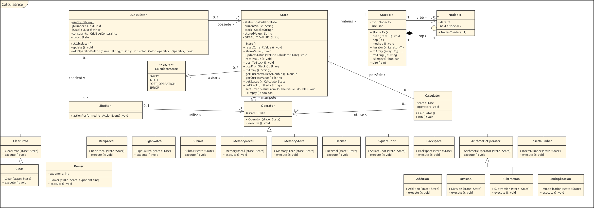

# Rapport Labo 6 - Calculatrice

Jano Ahmad
&
Richard Aurélien

## Introduction

Ce rapport présente notre projet de calculatrice en Java. L'objectif principal était de concevoir une calculatrice fonctionnelle en utilisant les principes de la programmation orientée objet. Inclus dans le rapport: le code source du projet, un diagramme UML de classes pour illustrer la structure du programme, ainsi que les détails des tests effectués pour assurer la fiabilité de notre application graphique et en mode CLI.

## Structure du code

### Diagramme de Classes UML

Le diagramme de classes UML ci-dessous illustre la structure des classes dans notre projet Calculatrice, offrant une vue claire sur les relations entre celles-ci.



### Fonctionalités

#### Classe `Stack`

La class `Stack` est la classe permettant le stockage en pile des valeurs.

Elle contient une classe interne `Node` qui permet de stocker et chainer des valeurs. `Node` va stocker la valeur donnée ainsi que le noeud suivant, cela permet de créer une chaîne de noeuds.

`Stack` va donc interagir avec les noeuds et va proposer des outils pour le faire. Elle va stocker le point de départ de la chaîne dans l'attribut `top` qui va correspondre au haut de la pile (une `Node`).

La classe met donc à disposition des outils pour interragir avec la pile, comme push(), pop() ou encore toArray().

#### Classe `State`

La classe `State` est le coeur de la calculatrice, c'est ici que les états et valeur vont être stockés.
Elle comprend plusieurs attributs dont la valeur courante, le stack, un état ainsi qu'une valeur stockée en mémoire.

Elle implémente un `Stack` afin de pouvoir stocker sur une pile les valeurs dont elle n'a besoin de suite (très courant dans la méthode RPN).

La valeur courante représente la valeur en cours d'utilisation alors que la valeur en mémoire représente une valeur stockée pour plus tard.

#### Interface `Operator`

L'interface `Operator` joue un rôle central dans notre conception, permettant d'abstraire les opérateurs qui interviendront dans la calculatrice. Cette interface définit une méthode `void execute()` qui va manipuler le State (que cela soit en intéragissant avec le stack, la valeur courante, la valeur en mémoire, etc...)

Exemple d'implémentation :

```java
package calculator;

/**
 * Power class
 */
public class Power extends Operator{
    private final int exponent;

    /**
     * Power constructor
     * @param state - State
     * @param exponent - Exponent for the power
     */
    public Power(State state, int exponent) {
        super(state);
        this.exponent = exponent;
    }

    /**
     * Execute method
     * Applies power to the current value
     */
    @Override
    public void execute() {
        if (this.state.getStatus().equals(State.CalculatorState.ERROR)) {
            return;
        }
        
        double number = this.state.getCurrentValueAsDouble();
        number = Math.pow(number, this.exponent);
        this.state.setCurrentValueFromDouble(number);
        this.state.updateStatus(State.CalculatorState.POST_OPERATION);
    }
}

```

#### Classe `ArithmeticOperator`
La classe ArithmeticOperator joue un rôle important dans la hiérarchie des opérateurs de la calculatrice. En tant que classe abstraite, elle fournit une base pour la mise en œuvre d'opérations arithmétiques spécifiques telles que l'addition, la soustraction, la multiplication et la division.

L'objectif principal de la classe est de définir la structure commune et le comportement attendu pour toutes les opérations arithmétiques. Elle encapsule la logique de base partagée par ces opérations, tandis que les sous-classes spécialisées, telles que Addition, Subtraction, Multiplication, et Division, fournissent l'implémentation spécifique de chaque opération. Chaque sous-classe doit fournir une implémentation de la méthode performOperation, décrivant comment l'opération particulière doit être effectuée.

```java
package calculator;

public abstract class ArithmeticOperator extends Operator {
    public ArithmeticOperator(State state) {
        super(state);
    }

    protected abstract Double performOperation(double d1, double d2) throws ArithmeticException;
    
    @Override
    public void execute() {
        // Shared logic between +, *, -, /
    }
}

```

#### Classe `Jcalculatrice`

La classe principale de la calculatrice graphique. Elle va construire l'application graphique en implémentant des JButton qui vont appeler des `Operator` et des JTextField et JTextList afin de tout fournir à l'utilisateur.
Elle a aussi un `State` qui va être le state principal.

#### Classe `Calculator`

Est une classe implémentant des `Operator` et un `State` permettant d'effectuer des opérations de calcul en CLI.

## Tests unitaires
Les tests unitaires pour l'application GUI visent à vérifier le bon fonctionnement des différentes fonctionnalités de la calculatrice.

### JCalculatorTest


Voici les scénarios importants testés:

#### Test de division par zéro (divisionZeroTest):
- Description : Vérifie si l'application signale correctement une division par zéro.
- Scénario : Insère le chiffre 5, effectue une soumission, puis insère le chiffre 0 et effectue une division.
- Résultat Attendu : La valeur d'erreur devrait être "Division by zero is not allowed".

#### Test de virgule multiple (multipleDecimalTest):
- Description : Vérifie si l'application gère correctement l'insertion de plusieurs décimales successives.
- Scénario : Insère le chiffre 1, suivi de quatre décimales, puis le chiffre 2.
- Résultat Attendu : "1.2".

#### Test d'opérande manquante (missingOperandTest):
- Description : Vérifie si l'application signale correctement une opération avec une opérande manquante.
- Scénario : Insère le chiffre 3, puis tente une opération d'addition.
- Résultat Attendu : La valeur d'erreur devrait être "Second operand missing".

#### Test d'addition avec nombres contenant des virgules (additionDecimalTest):
- Description : Vérifie si l'application effectue correctement une addition avec une décimale.
- Scénario : Insère le chiffre 3, suivi d'une décimale, puis le chiffre 5. Effectue une soumission, puis insère le chiffre 4 et effectue une addition.
- Résultat Attendu : "7.5"

#### Test de soustraction avec une seule insertion (subtractionOneInsertionTest):
- Description : Vérifie si l'application gère correctement la soustraction avec un seul saisi, c'est à dire bien considérer que la deuxième opérande est égal à 0.
- Scénario : Insère le chiffre 8, effectue une soumission, puis une soustraction.
- Résultat Attendu : "8"

#### Test de soustraction avec nombres négatifs (subtractionNegativeTest):
- Description : Vérifie si l'application effectue correctement la soustraction avec des nombres négatifs.
- Scénario : Insère le chiffre 2, effectue une soumission, insère le chiffre 5, puis effectue une soustraction.
- Résultat Attendu : "-3".

#### Test de division avec nombres flottants (divisionDecimalTest):
- Description : Vérifie si l'application effectue correctement une division avec une décimale.
- Scénario : Insère 7, suivi d'une décimale, puis 5, effectue une soumission. Ensuite, insère le chiffre 3 et effectue une division.
- Résultat Attendu : "2.5".

#### Test de racine carrée avec nombre négatif (squareRootNegativeTest):
- Description : Vérifie si l'application signale correctement l'utilisation d'une racine carrée sur un nombre négatif.
- Scénario : Insère le chiffre -1 et effectue une racine carrée.
- Résultat Attendu : La valeur d'erreur devrait être "Negative numbers with square roots are not allowed".

#### Test de valeur réciproque avec Zéro (reciprocalZeroTest):
- Description : Vérifie si l'application signale correctement une réciproque de zéro.
- Scénario : Insère le chiffre 0 et effectue une réciproque.
- Résultat Attendu : La valeur d'erreur devrait être "Division by zero is not allowed"

### CalculatorTest


Les tests pour les versions CLI partagent des objectifs similaires, se concentrant sur la validation de la fonctionnalité mise en œuvre. Cependant, leurs implémentations diffèrent en raison de la nature des interactions et des méthodes d'entrée associées à chaque interface.